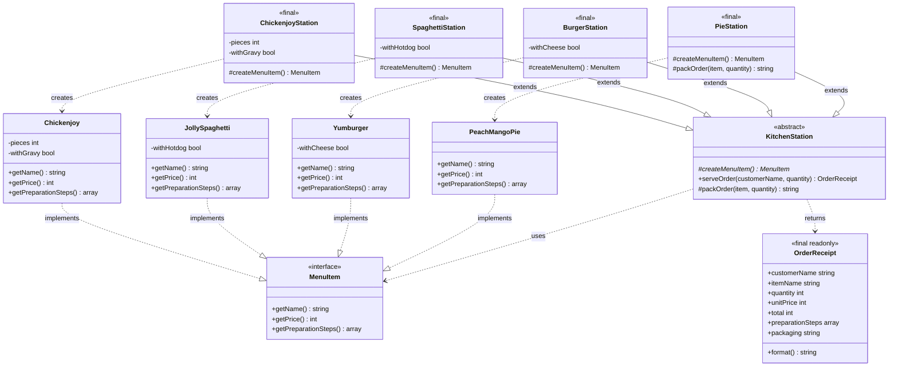

# Factory Method Pattern -- Class Diagram

**Name:** Ana Marietta Amor B. Reyes
**Section:** BSIT 3-A
**Subject:** IPT10 - Design Patterns in PHP

```mermaid
classDiagram
    class MenuItem {
        <<interface>>
        +getName() string
        +getPrice() int
        +getPreparationSteps() array
    }

    class Chickenjoy {
        -pieces int
        -withGravy bool
        +getName() string
        +getPrice() int
        +getPreparationSteps() array
    }

    class JollySpaghetti {
        -withHotdog bool
        +getName() string
        +getPrice() int
        +getPreparationSteps() array
    }

    class Yumburger {
        -withCheese bool
        +getName() string
        +getPrice() int
        +getPreparationSteps() array
    }

    class PeachMangoPie {
        +getName() string
        +getPrice() int
        +getPreparationSteps() array
    }

    class OrderReceipt {
        <<final readonly>>
        +customerName string
        +itemName string
        +quantity int
        +unitPrice int
        +total int
        +preparationSteps array
        +packaging string
        +format() string
    }

    class KitchenStation {
        <<abstract>>
        #createMenuItem()* MenuItem
        +serveOrder(customerName, quantity) OrderReceipt
        #packOrder(item, quantity) string
    }

    class ChickenjoyStation {
        <<final>>
        -pieces int
        -withGravy bool
        #createMenuItem() MenuItem
    }

    class SpaghettiStation {
        <<final>>
        -withHotdog bool
        #createMenuItem() MenuItem
    }

    class BurgerStation {
        <<final>>
        -withCheese bool
        #createMenuItem() MenuItem
    }

    class PieStation {
        <<final>>
        #createMenuItem() MenuItem
        #packOrder(item, quantity) string
    }

    Chickenjoy ..|> MenuItem : implements
    JollySpaghetti ..|> MenuItem : implements
    Yumburger ..|> MenuItem : implements
    PeachMangoPie ..|> MenuItem : implements

    ChickenjoyStation --|> KitchenStation : extends
    SpaghettiStation --|> KitchenStation : extends
    BurgerStation --|> KitchenStation : extends
    PieStation --|> KitchenStation : extends

    ChickenjoyStation ..> Chickenjoy : creates
    SpaghettiStation ..> JollySpaghetti : creates
    BurgerStation ..> Yumburger : creates
    PieStation ..> PeachMangoPie : creates

    KitchenStation ..> MenuItem : uses
    KitchenStation ..> OrderReceipt : returns
```
