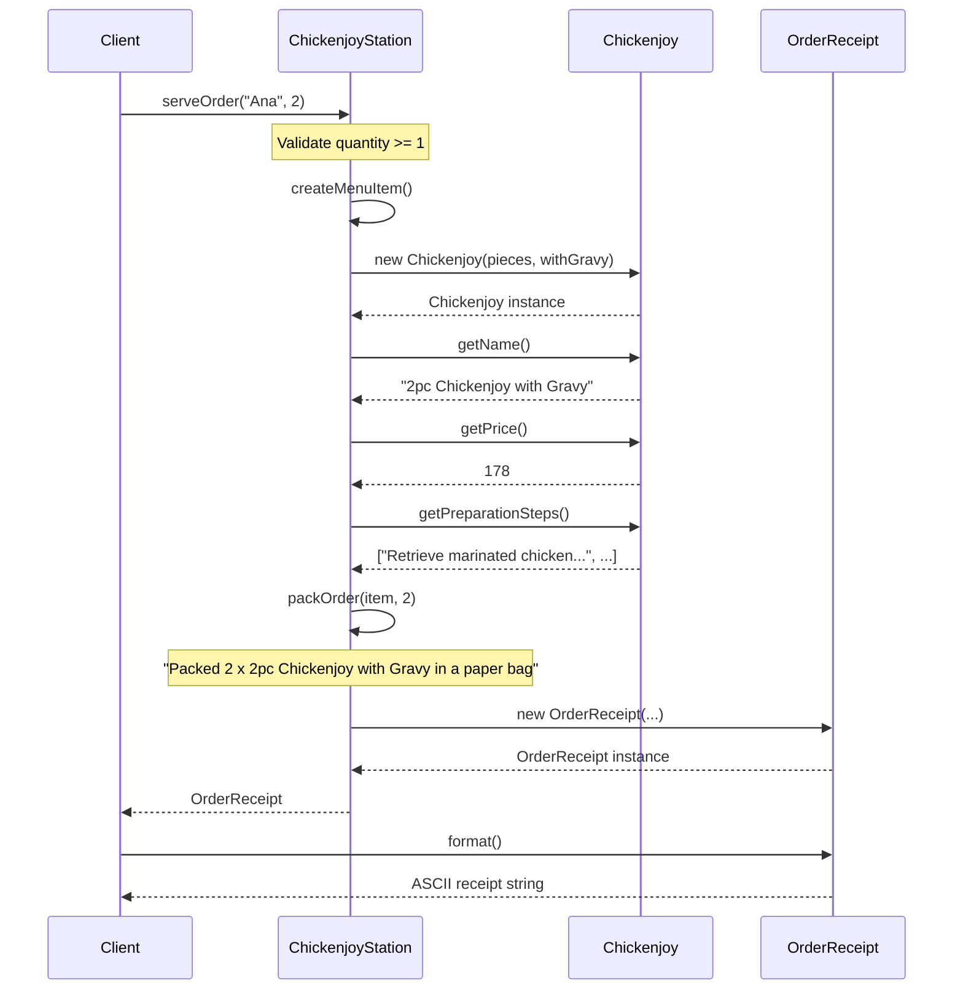

# Factory Method Pattern -- Sequence Diagram

**Name:** Ana Marietta Amor B. Reyes
**Section:** BSIT 3-A
**Subject:** IPT10 - Design Patterns in PHP

## Step-by-Step Explanation

1. **Client calls `serveOrder("Ana", 2)`** on the `ChickenjoyStation` (typed as
   `KitchenStation`). The client never knows which product is created.

2. **`serveOrder()` validates** that quantity is at least 1, then calls the
   abstract factory method **`createMenuItem()`** which is overridden by
   `ChickenjoyStation`.

3. **`createMenuItem()` instantiates** a new `Chickenjoy` object with the
   station's configuration (pieces, withGravy). This is the ONLY place where
   `new Chickenjoy` appears.

4. **The station queries the product** via `getName()`, `getPrice()`, and
   `getPreparationSteps()` -- all defined by the `MenuItem` interface.

5. **`packOrder()` is called** (the hook method). Since `ChickenjoyStation`
   does not override it, the default implementation in `KitchenStation` runs,
   producing a "paper bag" message.

6. **An `OrderReceipt` value object** is constructed with all the gathered
   data (customer name, item name, quantity, unit price, total, preparation
   steps, and packaging) and returned to the client.

7. **The client calls `format()`** on the receipt to get a printable ASCII
   string, completely decoupled from how the food was created.
